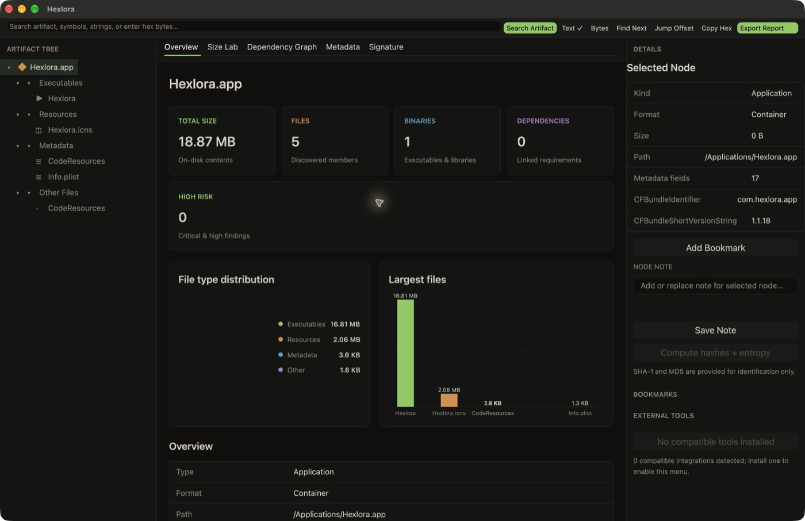

# Hexlora

[Discord](https://discord.gg/eGzEaP6TzR)

**English** · [简体中文](README.zh-CN.md) · [日本語](README.ja.md) · [Português (Brasil)](README.pt-BR.md) · [Español](README.es.md) · [Deutsch](README.de.md)

[](#requirements)
[](LICENSE)

Hexlora is a cross-platform, static application and binary inspection workbench written in Rust. It treats applications, directories, packages, and individual files as logical Artifacts, then presents their structure and PE, Mach-O, or ELF details through one host-independent analysis model.

English is the canonical README. Localized editions cover installation, major capabilities, safety boundaries, and documentation links; consult this edition for the most detailed and current support matrix.

## Screenshots

[](https://xnu.app/hexlora/#gallery)

The live [Hexlora gallery](https://xnu.app/hexlora/#gallery) rotates through application structure, Mach-O details, dependency resolution, extracted strings, and bounded hex inspection. The screenshots were captured from Hexlora while statically inspecting `/Applications/Hexlora.app`.

## Install with Homebrew

```sh
brew install --cask everettjf/tap/hexlora
```

Optional command-line tool:

```sh
brew install everettjf/tap/hexlora-cli
```

Verify the CLI installation:

```sh
hexlora-cli --version
```

The app bundle is Developer ID signed, Apple-notarized, and ships with a stapled notarization ticket so Gatekeeper can verify it without contacting Apple.

### Release requirements

Every distributed macOS build must pass the complete release trust chain: Developer ID Application signing, Apple notarization, ticket stapling, strict code-signature verification, stapler validation, and Gatekeeper assessment. Release archives must be produced with `scripts/release-macos.sh`; the unsigned or ad-hoc output of the lower-level build script must never be published. Apple credentials are supplied through environment variables and must not be printed, embedded, or committed.

## Requirements

- Apple silicon Mac (`arm64`)
- macOS 13 Ventura or later
- Homebrew for the installation commands above

Native Windows x64 and Linux amd64 packages are built by GitHub Actions. A tagged release publishes a Windows MSI and portable ZIP, plus a Debian package and portable Linux tarball. These packages currently are not code-signed; verify the accompanying `SHA256SUMS` before installing. The core remains host-independent and can inspect Windows PE and Linux ELF binaries on every supported host.

To produce the packages without publishing a release, run the **Package Windows and Linux** workflow manually. Creating a `v*` tag also uploads the verified artifacts to GitHub Releases.

The UI ships with a warm terminal-style dark theme derived from the semantic palette used by [xnu.app](https://xnu.app): warm near-black surfaces, paper-colored text, terminal green primary actions, and amber accents. Theme colors live in one semantic token module instead of individual views.

## Build and run on macOS

```sh
cargo run -p hexlora
```

Build a launchable macOS application bundle:

```sh
sh scripts/build-macos-app.sh
open dist/Hexlora.app
```

Use **File → Open Folder** for an application bundle or directory, and **File → Open File** for a package, executable, library, metadata file, or other binary. Files and folders can also be dragged directly into the center of the window.

## CLI

`hexlora-cli` is an independent executable; the desktop application remains GUI-only. It writes a versioned JSON report to stdout by default, keeping diagnostics on stderr so it can be used safely in scripts.

```sh
cargo run -p hexlora-cli -- inspect ./SomeApp.app --pretty
cargo run -p hexlora-cli -- inspect ./app.exe --depth deep --output report.json
cargo run -p hexlora-cli -- inspect ./package --hash sha256 --strings --entropy
```

### Release policies and CI

Hexlora can apply the same versioned release policy to IPA, APK, APPX/MSIX,
DEB, generic artifacts, and comparisons. Policies support built-in profiles
(`balanced`, `strict`, and `store_release`), explicit rule allow/deny lists,
severity overrides, and documented suppressions with optional expiry dates.

```bash
hexlora-cli inspect MyApp.ipa --depth deep \
  --policy examples/policies/store-release.json \
  --format sarif --output hexlora.sarif
```

Use [the store-release policy](examples/policies/store-release.json) as a
starting point. [The GitHub Actions example](examples/github-actions/hexlora-audit.yml)
shows policy enforcement, SARIF upload, and report retention. A policy failure
returns exit status `2`; incomplete analysis and cancellation have distinct
non-zero statuses.

Expensive work is opt-in. `--depth standard` performs structural analysis; `--depth deep` additionally enables SHA-256, strings, entropy, signature inspection, and the dependency graph. Individual tasks can be enabled explicitly. Pressing Ctrl-C cancels through the same analysis cancellation token used by the core.

Exit codes are `0` for a complete report, `1` for a fatal error, `2` when `--fail-on` reaches the requested finding severity, `4` when cancelled, and `5` for a usable but partial report. Output files are written atomically.

Release binaries and Homebrew metadata are available from [GitHub Releases](https://github.com/everettjf/homebrew-tap/releases) and through the Homebrew commands above, while the source repository is public.

## Product direction

Hexlora is being developed as a **safe static triage, comparison, and release-audit workbench for cross-platform software artifacts**. The canonical [product strategy and roadmap](docs/product-strategy.md) defines its users, principles, architecture, milestones, quality gates, and non-goals. The supporting [current-state and competitor analysis](docs/product-analysis-roadmap.md) and [IPAView convergence plan](docs/ipa-convergence-plan.md) provide the research and platform-specific execution detail.

## Desktop workflow

- Native macOS menus for opening files, folders, and workspaces, saving workspaces, editing text, and focusing search.
- `File → New Window` creates an independent inspection session; the native Window menu tracks open windows.
- Drag a file, application, package, workspace, or directory into the center to open it.
- Resizable Artifact Tree, inspector, and Details regions with virtualized tables for large inputs.
- Three saved workbench presets: **Standard**, **Focus**, and **Analysis**. Sidebar/inspector visibility and user-resized widths persist across launches, while each `File → New Window` session keeps independent artifact and navigation state.
- Optional high-contrast appearance, a prominent **Export Report** menu for comprehensive English Markdown/PDF analysis reports, a shareable SVG visual dashboard, and native interactive window screenshot capture. Exports stay local; Markdown and every PDF page end with **Powered by Hexlora** branding.
- A compact **External Tools…** menu shows compatible installed integrations first, distinguishes GUI launchers from captured command-line tools, and summarizes unavailable integrations without filling the Details pane with disabled buttons.
- Workspaces preserve the artifact path, selected view, bookmarks, notes, and cached analysis results.
- **File → Open Release Policy…** applies the same versioned IPA, Android, Windows,
  Linux, and comparison policy engine used by the CLI and presents violations in
  a dedicated Policy tab (`⌥⌘P`).

## Implemented inspection workflow

- Logical Artifact Tree groups executables, frameworks, libraries, plugins, resources, metadata, packages, archives, and disk images independently of their physical paths.
- The Artifact Tree, global results, Strings, symbols, dependencies, graph edges, sections, segments, and relocation tables use GPUI virtual rendering, so large artifacts instantiate only rows inside the current viewport.
- A host-independent `BinaryAnalyzer` interface dispatches to concrete `PeAnalyzer`, `MachOAnalyzer`, and `ElfAnalyzer` implementations. Unified PE, Mach-O, Universal Mach-O, and ELF results expose headers, sections, imports, exports, symbols, dependencies, signatures, metadata, entropy, and inspection findings without leaking parser-specific types into the UI.
- Binary containers and ar libraries are parsed with `goblin`; PE embedded signatures with `authenticode`; Apple UDIF/DMG containers with `udif`; Apple XAR/flat PKG containers with `apple-xar`; tar streams with `tar`; XML with `quick-xml`; plists with `plist`; ZIP central directories with `zip`; file mapping with `memmap2`; and digests with the RustCrypto hash crates. Hexlora's own code focuses on the Artifact model, safe limits, normalization, orchestration, and UI.
- Universal Mach-O slices are parsed independently and selectable from the **Slices** tab.
- Artifact-wide dependencies are built lazily into a cancellable **Dependency Graph** with a visual source-to-target map plus a precision table, source architecture, bundled/system/missing/unknown resolution, and resolved target paths.
- Strings include ASCII, UTF-8, UTF-16LE, UTF-16BE, file offsets, section names, and virtual addresses where mapping information exists.
- Hex inspection reads 4 KiB windows on demand and supports offset jumps, byte/text search, selection, and copy without loading the complete file into the UI.
- Hashes plus whole-file and section entropy are explicit, cancellable, cached tasks. A distributed 64 KiB entropy Area Chart and heatmap can jump directly into Hex at suspicious blocks. SHA-1 and MD5 are labeled as identification-only algorithms; opening an Artifact, global search, and dependency graph construction do not eagerly hash files or calculate entropy.
- Mach-O parsing reports the embedded code-signature blob statically. Host cryptographic verification, entitlements, hardened-runtime details, and Gatekeeper/notarization assessment run in the background only when the Signature view is selected; each subprocess has a 30-second timeout and 4 MiB output limits.
- ZIP inspection reads only the central directory and reports unsafe paths, symbolic links, expansion ratio, and suspicious expanded size. It does not extract entries.
- DMG and ISO disk images are recognized from container structure rather than extension. Their volume, partition, and compression metadata are inspected statically without mounting or extraction.
- Static ar libraries, tar/tar.gz archives, and Apple XAR/flat PKG installers expose bounded member tables, declared sizes, link/path hazards, checksums, and embedded-signature counts without extracting payloads or launching Installer.
- IPA release audits cover app identity, installed size, embedded targets, architectures,
  localizations, privacy manifests, provisioning profiles, entitlements, findings, evidence
  navigation, and an IPAView-compatible JSON projection.
- Android APK, Windows APPX/MSIX, and Debian DEB release packs provide platform-specific identity,
  permission/capability/dependency, signing or installation-risk findings in both desktop and CLI.
- Artifact comparison uses exact SHA-256 content identity and reports added, removed, modified, and
  moved files; directory and file-type growth; duplicates; and IPA privacy/signing/entitlement
  changes. See the [versioned report schema](docs/report-schema.md).
- Workspaces preserve the Artifact path, selected node/view, bookmarks, notes, and tool configuration model.
- External tools are detected through `ToolRegistry`, launched only by explicit action, and bounded command output is captured in the Details pane where supported. Captured runs are cancellable, stop after 60 seconds, cap each output stream at 16 MiB, and terminate the child process on timeout.

Keyboard shortcuts on macOS: `⌘N` opens a new window, `⌘O` opens a file, `⇧⌘O` opens a folder, `⌥⌘O` opens a workspace, `⌘S` saves a workspace, and `⌘F` focuses global search.

## Detailed support matrix

Hexlora separates three levels of support: **audit** means platform-aware release semantics and findings; **inspect** means bounded structural parsing and navigation; **identify** means reliable type recognition with the universal metadata, search, strings, hash, entropy, and Hex workflows still available.

### Applications and release packages

| Artifact | Level | Implemented capabilities |
|---|---|---|
| macOS `.app`, frameworks, bundles, plug-ins and directories | Inspect | Logical component tree; executables, frameworks, libraries, plug-ins and resources; Info.plist metadata; Mach-O slices; dependencies; static and host-verified signatures; entitlements; Hardened Runtime; Gatekeeper/notarization assessment; hashes, entropy, strings and Hex |
| iOS `.ipa` | Audit | Virtual ZIP tree without extraction; `Payload/*.app` discovery; app identity, Bundle ID, version/build and minimum OS; installed and compressed sizes; embedded apps, extensions and frameworks; architectures and simulator-slice checks; localizations; usage descriptions and `PrivacyInfo.xcprivacy`; provisioning profile, Team/Application ID, expiration and entitlements; evidence-linked findings; IPAView-compatible JSON |
| Android `.apk` | Audit | Binary AndroidManifest parsing; package/version/SDK identity; application flags; permissions, exported components, intent filters and deep links; DEX string/type/field/method/class counts; `resources.arsc` size; native libraries and ABI evidence; signing-scheme indicators; release findings |
| Windows `.appx` / `.msix` | Audit | AppxManifest identity; publisher, version and architecture; target device families; normal and restricted capabilities; applications, executables and entry points; block-map and package-signature presence; release findings |
| Debian `.deb` | Audit | Control metadata, package identity, version, architecture, maintainer, dependencies and description; installed size; payload file table and largest files; Unix modes and privileged-file checks; maintainer scripts; release findings |
| Apple flat `.pkg` / `.mpkg` and XAR | Inspect | Bounded XAR table of contents, member sizes, checksums, embedded-signature count and unsafe-path indicators; does not launch Installer or extract payloads |
| Windows `.exe`, `.dll`, `.sys` and other PE/COFF | Inspect | PE headers, architecture, sections, relocations, imports, exports, symbols, dependencies, entry point, image base, Authenticode blob/status metadata and findings; analysis works on macOS without executing the file |
| Linux executables, shared objects and other ELF files | Inspect | ELF headers, class/endian/architecture, interpreter, sections, segments, relocations, dynamic imports/exports, symbols, dependencies, entry point, build metadata and findings; analysis works on macOS without executing the file |

### Binary formats, containers and data

| Format or content | Level | Implemented capabilities |
|---|---|---|
| Mach-O and Universal/Fat Mach-O | Inspect | Per-slice architecture and file range; headers, load-command metadata, sections, segments, relocations, imports, exports, symbols, dylib dependencies, entry point and code-signature blob |
| ZIP containers | Inspect | Central-directory-only member tree, compressed/expanded sizes, CRC metadata, symlink detection, traversal/absolute-path hazards, expansion ratio and suspicious expanded-size findings; no extraction |
| Electron ASAR archives | Inspect | Virtual member tree without extraction; per-member size and readable bytes for Hex, strings, search and hashing; header metadata including member count, declared bytes and data offset; unpacked members resolve to the sibling `.asar.unpacked` files |
| Apple Compiled Asset Catalog (`.car`) | Inspect | BOM header metadata (version, block count, block table); named section keys such as CARHEADER, RENDITIONS, FACETKEYS and KEYFORMAT; renditions are not extracted |
| Apple ICNS icons | Inspect | Declared size and a bounded chunk table listing icon types and byte sizes |
| Chromium Data Pack (`.pak`) | Inspect | Version, text encoding, resource/alias counts and a bounded resource identifier index |
| WebAssembly (`.wasm`) | Inspect | Version, section table, import/export/function counts and exported names |
| Windows shell links (`.lnk`) | Inspect | Link flags, file attributes, file size, icon index, show command and FILETIME timestamps |
| WAV (`.wav`) | Inspect | Codec, channels, sample rate, bits per sample and duration |
| FLAC (`.flac`) | Inspect | Sample rate, channels, bits per sample, total samples and duration |
| Ogg (`.ogg`, `.opus`) | Inspect | Codec (Vorbis/Opus/FLAC), sample rate and channel count |
| Java class files (`.class`) | Inspect | Class-file version, Java version, constant-pool count, modifiers, this/super class and field/method counts |
| HEIC / HEIF (`.heic`, `.heif`) | Inspect | Major/compatible brands and image dimensions |
| Matroska / WebM (`.mkv`, `.webm`) | Inspect | Doc type, timecode scale and duration |
| Fonts (`.ttf`, `.otf`, `.woff`, `.woff2`) | Inspect | SFNT flavor, table count, family/subfamily/full/PostScript names, units-per-em, glyph count and weight class; WOFF/WOFF2 container metadata without decompression |
| PDF (`.pdf`) | Inspect | Version, page count, title/author/creator/producer metadata and encryption indicator without rendering |
| MP4 / M4A (`.mp4`, `.m4a`) | Inspect | Major and compatible brands, movie timescale and duration |
| MP3 (`.mp3`) | Inspect | ID3v2 tag version/size plus the first MPEG audio frame's version, layer, bitrate, sample rate and channel mode |
| Python bytecode (`.pyc`) | Identify | CPython magic number and hash-based flag |
| GNU gettext (`.mo`) | Inspect | Endianness, revision, string count and table offsets |
| Qt resources (`.rcc`, `.qm`) | Identify | Qt compiled-resource or message-catalog recognition and version |
| Textures (`.ktx`, `.ktx2`, `.dds`, `.exr`) | Inspect | Container type, dimensions, faces and mipmap levels |
| Apple Metal library (`.metallib`) | Identify | Container and version recognition; shader bytecode is not disassembled |
| Swift modules (`.swiftmodule`, `.swiftdoc`) | Identify | Compiler-artifact recognition by magic; internals are not parsed |
| 3D meshes (`.stl` binary) | Inspect | Triangle count for binary STL; text `.stl`/`.obj` are discovered as text |
| Roblox models (`.rbxm`, `.rbxl`) | Identify | Roblox model recognition by header |
| tar, tar.gz and tgz | Inspect | Bounded member table, sizes, modes, links and path hazards without extracting files |
| ar archives and static libraries | Inspect | Bounded member table and sizes; Debian packages receive the deeper platform audit above |
| Apple UDIF/DMG | Inspect | Trailer and container metadata, partitions, sectors, compressed blocks and compression ratios; recognized by structure and never mounted |
| ISO 9660 | Inspect | Volume descriptor, volume identifier, sector and block-size metadata; never mounted |
| JSON, XML and XML/binary plist | Inspect | Bounded structured parsing and flattened metadata; plist and manifest fields feed platform-aware audits where applicable |
| SQLite 3 | Inspect | Header, page size, read/write versions, schema format and text encoding |
| Images | Inspect | Format, dimensions and pixel count for image formats supported by the metadata parser; no EXIF forensics or image editor |
| UTF-8 text and `.desktop` metadata | Inspect | Text/resource discovery, global search and parsed desktop-entry key/value metadata |
| 7z, RAR and standalone gzip/bzip2/xz/zstd streams | Identify | Container/type identification plus universal file workflows; full member browsing is not yet implemented |
| Unknown or extensionless files | Identify | Magic-based classification where possible; size and timestamps; byte/text search; bounded Hex; optional SHA-256/SHA-1/MD5, entropy and strings |

### Views and analysis operations

| Surface | What is available |
|---|---|
| Artifact Tree | Logical grouping of executables, frameworks, libraries, plug-ins, resources, metadata, archive members, packages and disk images; directory discovery never follows symbolic links |
| Overview and Metadata | Kind, format, path, size, architecture, bitness, endian, entry point, image base, interpreter, parsed metadata, dependency/signature summaries and analysis errors |
| Headers, Slices, Sections and Segments | Unified PE/Mach-O/ELF headers; Universal Mach-O slice selection; address/file layouts, flags and lazy section entropy |
| Imports, Exports, Symbols and Relocations | Filterable, virtualized tables with names, addresses, libraries, relocation types, symbols and addends where the source format provides them |
| Dependencies and Dependency Graph | Per-binary requested libraries plus a Canvas-rendered artifact-wide node graph with clickable source/target nodes and a precision table; architecture and bundled/system/missing/unknown resolution with target paths |
| Size Lab | Metric cards, file-type donut, largest-file bars and an interactive treemap; comparison mode adds size waterfall, type deltas, top growth, duplicate savings and diff treemap |
| Entropy | Distributed 64 KiB samples rendered as an Area Chart and heatmap; click a block to open its exact offset in Hex |
| Strings | ASCII, UTF-8, UTF-16LE and UTF-16BE; file offsets, encodings, section names and virtual addresses where mapping exists |
| Hex | Read-only 4 KiB windows, offset jumps, byte/text search, selection and copy without loading the complete file |
| Signature | Static embedded signature metadata; visual trust/provisioning timelines; on macOS, opt-in bounded `codesign`/Gatekeeper verification, entitlements, signer, Team ID, timestamp, Hardened Runtime and notarization status |
| Findings and Policy | Severity aggregation and filters, rule/message and evidence navigation across generic, IPA, Android, Windows and Linux analysis; shared profiles, rule controls, overrides and time-bounded suppressions in desktop and CLI |
| Compare | Exact SHA-256 content identity; added/removed/modified/moved files; directory and type growth; duplicates and largest growth; IPA identity, target, architecture, localization, privacy, signing, entitlement and finding changes |
| Search | Artifact-wide search across names, metadata, symbols and strings, plus direct hexadecimal byte queries |
| Workspaces | Artifact path, selected node/view, bookmarks, notes, tool configuration and cached analysis snapshot |
| External tools | Explicit launch of compatible GUI tools; bounded, cancellable captured output for supported command-line tools; installed tools are prioritized |
| Report export | Comprehensive local English Markdown/PDF reports containing artifact summary, complete inventory, analysis coverage, cached binary/hash/entropy details, strings, dependency graph, signatures, platform audits, policy results, comparison data, bookmarks and notes; uncomputed optional dimensions are identified explicitly; every export carries Powered by Hexlora branding |
| Visual reports | Local, shareable SVG dashboard with artifact metrics, finding counts and file-type composition, plus native window screenshot capture; no artifact bytes are uploaded |

### CLI, reports and CI

- `inspect` supports `lightweight`, `standard`, and `deep` analysis; explicit hashes, strings, entropy, signatures and dependency graph; cancellation and atomic output files.
- Reports are available as versioned JSON, Markdown, standalone HTML and SARIF. Every format includes the unified generic/platform findings and policy violations.
- `--fail-on` evaluates the same aggregated generic, IPA, Android, Windows and Linux findings. Release policies apply common size/severity gates and platform-specific privacy, architecture, entitlement, permission, capability, signature, DEX, installed-size, maintainer-script and privileged-file rules.
- `compare` emits deterministic JSON and can enforce growth, newly introduced finding/entitlement, and added-architecture policies.
- Stable exit codes distinguish fatal errors (`1`), policy/finding failures (`2`), cancellation (`4`) and usable partial reports (`5`).
- The repository CI runs the full workspace tests and Clippy on current stable Rust, verifies the actual Rust 1.88 minimum, builds and launches the macOS App, and checks that the release script retains every signing/notarization validation contract.

### Deliberate boundaries

Hexlora is a static, read-only workbench. It does not execute imported programs, mount images, install packages, automatically extract archives, disassemble into assembly listings, decompile code, debug processes, patch bytes, or claim that a heuristic finding proves malware. Desktop builds are available for Apple-silicon macOS 13 or later, Windows x64, and Linux amd64. MSI, RPM, AAB/XAPK, 7z and RAR do not yet have the same platform-semantic audit depth as IPA, APK, MSIX or DEB.

## Release verification

Distributed releases are validated with the complete Rust workspace test suite, Homebrew strict Formula and Cask audits, a real Homebrew installation of both artifacts, the Formula test, archive integrity checks, arm64 binary inspection, version checks, strict `codesign` verification, Apple notarization, stapler validation, and Gatekeeper assessment.

The [automated testing matrix](docs/testing.md) documents exactly which semantic, CLI, desktop,
release, and packaging behaviors run in CI, along with the remaining native UI testing boundary.

### Real-world regression corpus

Synthetic fixtures are complemented by a pinned public corpus of 16 real artifacts spanning IPA,
APK, APPX/MSIX, signed and deliberately corrupted macOS apps, notarized PKG, DMG, ISO, PE, ELF,
DEB, RPM, and intentionally damaged APPX packages. Downloads are byte-length and SHA-256 pinned;
the test runner never executes or installs them and checks format-specific report assertions. This
scheduled/manual gate catches integration and platform-trust behavior that small fixtures cannot.
See the [corpus provenance and coverage](tests/real-world-corpus/README.md).

## Safety

Imported artifacts are untrusted input. Hexlora performs static inspection and never executes an imported program. External tools are launched only after an explicit user action. High entropy and other findings are indicators, not malware verdicts.

Directory discovery does not follow symbolic links. Parser input, structured metadata, recursion depth, file count, strings, relocation lists, archive entries, captured command output, and displayed rows have explicit limits. ZIP files are inspected through their central directory without extraction, including traversal, symbolic-link, expanded-size, and compression-ratio indicators.

## Workspace

- `hexlora-core`: host-independent Artifact, analysis, finding, signature, and workspace models
- `hexlora-format`: magic detection and unified PE/Mach-O/ELF parsing
- `hexlora-analysis`: discovery, cache, hashing, entropy, strings, and chunked hex access
- `hexlora-tools`: extensible external tool registry
- `hexlora-ui`: GPUI macOS desktop application
